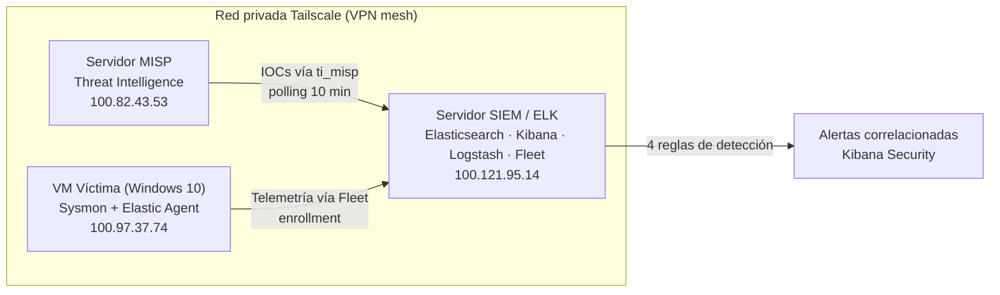

# 🛡️ Ciclo de Detección de Amenazas con Threat Intelligence

**Laboratorio de detección end-to-end: MISP + SIEM (Elastic Stack) + ejecución controlada de ransomware real (Bad Rabbit)**

[](https://www.elastic.co/)
[](https://www.misp-project.org/)
[](https://learn.microsoft.com/sysinternals/downloads/sysmon)
[](https://tailscale.com/)
[](https://attack.mitre.org/)
[](https://keepcoding.io/)

Proyecto integrador final del Bootcamp en Ciberseguridad de KeepCoding (CS11), desarrollado por el equipo **Nullsec**. Implementa un ciclo completo de detección de amenazas: desde la carga curada de IOCs de un ransomware real en una plataforma de Threat Intelligence, hasta su correlación automática en un SIEM contra telemetría generada por la ejecución controlada de la muestra en un endpoint aislado.

---

## 📋 Tabla de contenidos

- [Resumen](#-resumen)
- [Arquitectura](#-arquitectura)
- [Equipo y roles](#-equipo-y-roles)
- [Stack tecnológico](#-stack-tecnológico)
- [Qué se implementó](#-qué-se-implementó)
- [Reglas de detección](#-reglas-de-detección)
- [Indicadores de compromiso (IOCs)](#-indicadores-de-compromiso-iocs)
- [Mapeo MITRE ATT&CK](#-mapeo-mitre-attck)
- [Resultados / evidencia](#-resultados--evidencia)
- [Estructura del repositorio](#-estructura-del-repositorio)
- [Consideraciones éticas y de seguridad](#-consideraciones-éticas-y-de-seguridad)
- [Limitaciones y mejoras futuras](#-limitaciones-y-mejoras-futuras)
- [Documentación completa](#-documentación-completa)

---

## 📖 Resumen

Este proyecto integra tres componentes desarrollados de forma independiente por cada integrante del equipo:

1. **MISP** — plataforma de Threat Intelligence que centraliza 39 IOCs del ransomware **Bad Rabbit**, curados manualmente y clasificados con MITRE ATT&CK.
2. **SIEM (Elastic Stack)** — Elasticsearch + Kibana + Logstash + Fleet, que sincroniza esos IOCs vía la integración nativa `ti_misp` y correlaciona eventos en tiempo real con 4 reglas de detección propias.
3. **VM víctima (Windows 10)** — endpoint aislado en red NAT dedicada, instrumentado con Sysmon y Elastic Agent, donde se ejecutó una muestra real de Bad Rabbit para generar telemetría genuina.

**Resultado:** un IOC cargado manualmente en MISP terminó disparando una alerta real en el SIEM tras la ejecución del malware correspondiente, validando el ciclo de detección de extremo a extremo.

---

## 🏗️ Arquitectura

Los tres nodos se comunican exclusivamente a través de una red mesh privada (Tailscale), sin exponer ningún servicio a internet.



**Flujo end-to-end:**

1. Análisis dinámico de la muestra en sandbox (CAPEv2) → produce los IOCs iniciales
2. Carga curada de esos IOCs en MISP, clasificados con MITRE ATT&CK
3. Sincronización periódica hacia el SIEM vía integración nativa `ti_misp`
4. Ejecución controlada del malware en la VM víctima → telemetría real vía Elastic Agent + Sysmon
5. Correlación automática entre telemetría real e IOCs mediante 4 reglas de detección activas

---

## 👥 Equipo y roles

| Integrante | Rol | Responsabilidad |
|---|---|---|
| **Brayan Gabriel Gutiérrez Rebolledo** | MISP / Threat Intelligence | Instalación de MISP, curación de 39 IOCs, conexión segura vía Tailscale |
| **Juan Malbrán** | SIEM / ELK Stack | Elasticsearch, Kibana, Logstash, Fleet Server, reglas de detección |
| **Irene Alcalá Serrano** | VM Víctima / Ejecución Controlada | Aislamiento de red, telemetría de endpoint, ejecución del malware |

---

## 🧰 Stack tecnológico

- **Threat Intelligence:** MISP (Malware Information Sharing Platform)
- **SIEM:** Elastic Stack 8.19.16 (Elasticsearch, Kibana, Logstash, Fleet Server, Elastic Agent)
- **Telemetría de endpoint:** Sysmon v15.21 (Sysinternals)
- **Red privada:** Tailscale (VPN mesh, WireGuard)
- **Análisis de malware:** CAPEv2 (sandbox), MalwareBazaar (fuente de la muestra)
- **Muestra analizada:** Bad Rabbit (ransomware)
- **Framework de referencia:** MITRE ATT&CK
- **Aislamiento:** red NAT dedicada en VirtualBox (`SIEMLab`, 10.0.2.0/24)

---

## ✅ Qué se implementó

- Plataforma MISP con 39 IOCs curados manualmente (hashes, IPs de C2, dominios, URLs, claves de registro, tareas programadas) y clasificación MITRE ATT&CK.
- SIEM completo sobre Elastic Stack 8.19.16, con Fleet Server gestionando 2 políticas de agente (servidor + endpoint Windows).
- Integración `ti_misp` para consumo nativo de IOCs vía API REST (se descartó TAXII por problemas de certificados SSL).
- 4 reglas de detección activas en Kibana Security (Custom Query, ejecución cada 5 minutos).
- Red NAT aislada dedicada para contener la ejecución del malware, sin conectividad hacia redes de producción.
- Instalación de Sysmon en el endpoint para capturar ejecución de procesos (sin él, la integración estándar de Windows solo registra logs de PowerShell).
- Ejecución controlada y documentada de una muestra real de Bad Rabbit, con verificación cruzada de hashes, IPs y comportamientos entre los tres informes individuales.

---

## 🔍 Reglas de detección

| Regla | Severidad | Risk Score |
|---|---|---|
| Detección de script BadRabbit en PowerShell | Critical | 99 |
| Conexión a IP maliciosa (BadRabbit / STOP Ransomware) | Critical | 99 |
| Consulta DNS a dominio malicioso | High | 73 |
| Acceso a URL maliciosa (BadRabbit / STOP Ransomware) | High | 73 |

Todas son de tipo *Custom Query* (KQL) sobre `logs-windows.*`, con ejecución cada 5 minutos y 1 minuto de look-back adicional.

---

## 🎯 Indicadores de compromiso (IOCs)

| Tipo | Cantidad / Detalle |
|---|---|
| Atributos IOC cargados en MISP | 39 |
| Hashes de la muestra | SHA256, SHA1, MD5 |
| IPs maliciosas (C2 y payload) | 13 |
| Dominios maliciosos | 6 |
| Archivos dropeados | `dispci.exe`, `infpub.dat`, `cscc.dat` |
| Retención (IOC Expiration Duration) | 90 días |

> Los hashes y dominios corresponden a Bad Rabbit, un ransomware ampliamente documentado desde 2017 (fuente pública: MalwareBazaar). Se incluyen únicamente con fines de inteligencia de amenazas y detección.

---

## 🗺️ Mapeo MITRE ATT&CK

| Táctica | Técnica (ID) | Evidencia |
|---|---|---|
| Defense Evasion / Execution | T1218 – Signed Binary Proxy Execution (`rundll32.exe`) | Observado directamente en el laboratorio |
| Impact | T1485 – Data Destruction | Cifrado de archivos y nota de rescate |
| Defense Evasion | T1562.001 – Impair Defenses | Evento `antivirus-configuration-changed` |
| Persistence / Priv. Escalation | T1053 – Scheduled Task/Job | Clasificación del evento en MISP |
| Credential Access | T1003 – OS Credential Dumping | Clasificación del evento en MISP (CAPEv2) |
| Defense Evasion | T1027 – Obfuscated Files or Information | Clasificación del evento en MISP |
| Command and Control | T1071 – Application Layer Protocol | Reglas de detección de IP/URL |
| Persistence | T1543.003 – Windows Service | Clasificación del evento en MISP |
| Defense Evasion | T1070 – Indicator Removal on Host | Clasificación del evento en MISP |

> No se ejecutó movimiento lateral real (SMB/EternalRomance) ni cifrado completo de disco (DiskCryptor a nivel de MBR); el alcance se limitó a un único host aislado.

---

## 📊 Resultados / evidencia

- **484** eventos de amenaza sincronizados desde MISP (`logs-ti_misp.threat-default`)
- **2.457+** eventos de PowerShell capturados desde la VM víctima
- **46** documentos relacionados con la ejecución de `BadRabbit.exe` encontrados en Discover
- **4/4** reglas de detección activas con última ejecución `Succeeded`
- Verificación cruzada de hashes, IPs, dominios y comportamientos entre los tres informes individuales del equipo

---

## 📁 Estructura del repositorio

> Ajusta esta sección según cómo termines organizando tus archivos.

```
.
├── README.md
├── docs/
│   ├── Informe_final_Nullsec.pdf        # Informe técnico completo (3 partes + anexos)
│   └── Presentacion_final_Nullsec.pdf   # Slides de la presentación final
└── screenshots/                          # Capturas de configuración y evidencia (opcional)
```

---

## ⚠️ Consideraciones éticas y de seguridad

- La muestra de Bad Rabbit se ejecutó **exclusivamente** dentro de una red NAT aislada (`SIEMLab`, 10.0.2.0/24), sin conectividad hacia redes de producción ni hacia la red doméstica de ningún integrante.
- La descarga se realizó desde una fuente controlada y reconocida para investigación de malware (MalwareBazaar).
- La desactivación de Windows Defender y del Firewall se limitó exclusivamente a la VM aislada, nunca al equipo físico anfitrión.
- El acceso a la VM y a la muestra estuvo restringido a la integrante responsable de esa etapa del proyecto.
- Recomendación de cierre: eliminar o restaurar a un snapshot previo la VM infectada una vez documentada toda la evidencia; no transferir la muestra fuera del entorno aislado.

---

## 🔮 Limitaciones y mejoras futuras

- No se evaluó propagación lateral real (EternalRomance/SMB, credenciales robadas con Mimikatz); la ejecución se limitó a un único host.
- Detección únicamente pasiva — no se incorporó un SOAR para automatizar la respuesta ante alertas críticas.
- Carga de IOCs manual (decisión de diseño para asegurar calidad); una mejora futura sería sumar feeds automáticos de MISP manteniendo el mismo criterio de curación.
- Migrar de certificados auto-firmados a certificados válidos, eliminando la necesidad de deshabilitar la verificación SSL entre componentes.
- Automatizar el despliegue con Infrastructure as Code (por ejemplo, Ansible) para hacerlo reproducible.

---

## 📄 Documentación completa

- 📘 [Informe técnico completo](./docs/Informe_final_Nullsec.pdf) — instalación, configuración, troubleshooting y comandos completos de cada componente
- 🖥️ [Presentación final](./docs/Presentacion_final_Nullsec.pdf)

---

**Equipo Nullsec** · Bootcamp en Ciberseguridad, KeepCoding (CS11) · Julio 2026
